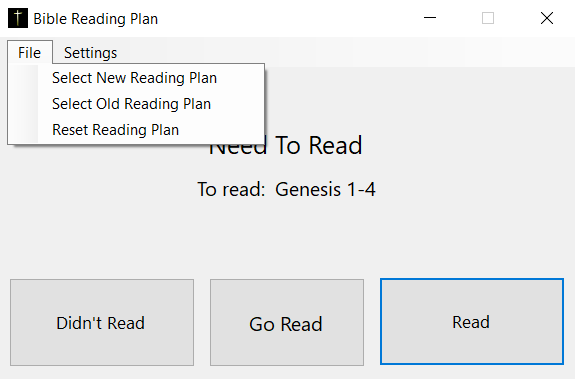

# Bible-Reading-Plan

This program keeps track of your daily bible reading. It will display the passage for today along with the number of days ahead/behind schedule your are. There are buttons to update the program when you read and to open the passage on BibleGateway if you need a digital copy. The program also has settings to adjust how the application looks and to select your favorite bible translation.

When you open the application for the first time, you will see two buttons: ‘Select New Reading Plan’ and ‘Select Old Reading Plan’. ‘Select New Reading Plan’ will select a new bible reading plan and reset the timer, so today is the first day. ‘Select Old Reading Plan’ will select a new bible reading plan but won’t reset the timer, so any progress you’ve made on the plan won’t get erased.

With either select plan button, when clicked, a file explore will open up to the ‘Plans’ folder. By default, there are 4 plans (though more can be added). The first is the read your bible in a year plan. The second plan is the bible with the Apocrypha/ Deuterocanonical books. Not all bible translations have these books, so you will need to select a bible translation that does. There are also plans for just the Old Testament and just the New Testament. These ones aren’t year long, but are merely the respective sections of the bible in a year plan. 

Once a Plan has been selected, the Main Window will look like this. There will be two lines of text and three buttons. The top line displays whether you need to read or how many days ahead / behind you are. The second line displays the passage you need to read. The ‘Go Read’ button opens the passage on BibleGateway. The ‘Read’ button increments the counter one day ahead. The ‘Didn’t Read’ button decrements the timer one day behind (you don’t need to press the button every time you miss a reading, the program will take care of that for you. Just press this button if you need to go back to a previous day)

Under the File tab there are three buttons. The first to are the some ‘Select New Reading Plan’ and ‘Select Old Reading Plan’ that you see on the default screen. The third one is the ‘Reset Reading Plan’ this one will reset the currently selected plan so that today is counted as the first day.

Under the Settings tab there are also three buttons. The first button ‘Set Bible Version’ Opens up a new window where you can input your preferred bible translation. The second adds two buttons to the screen that allow you to update the passage without updating the timer. The third button allows you to choose weather you want the text to turn red when you’re behind and green when your ahead, or if you just want it to remain black at all times.

